# WormBox Tutorial

[**WormBox**](https://github.com/bruvellu/WormBox) (Vellutini & Marques, 2011--2022) is a plugin to Fiji/ImageJ that was written with the intent to help you to automate the uptake of measurements from sets of images.
This macro is based on plotting landmarks upon images from which a table with linear distances will be
generated.
You can also use it to count structures (*i.e.*, meristic variables).
We have not tested how effective timewise this plugin will be in comparison to the traditional methods most people obtain measurements from specimens.
We expect it will vary a lot among cases.
Ultimately, it will all depend on how easy (and fast) you can produce images from which you can extract the measurements you need.
If that is not an issue, we believe you will find that this application will speed up data gathering.
You should also consider that, even if you do not speed up your work by using this application, using it will provide you with full documentation of your measurements---which usually is not the case by traditional methods.
Be that as it may, give it a try.
We will be happy if it turned out to be a good tool for your research.
To download the most recent version of the plugin, [press here](https://github.com/bruvellu/WormBox).

=== System requirements ===

As this application makes full usage of Fiji/ImageJ, which can be
downloaded from [Fiji\'s website](http://fiji.sc/wiki/index.php/Fiji),
as long as you meet the system requirements of Fiji/ImageJ, this
application will work. Thus, before you start you should install
Fiji/ImageJ. After installing Fiji/ImageJ, you should verify whether
there are updates for Fiji and/or ImageJ available. To accomplish that,
open the casting menus of Help in the main menu of Fiji/ImageJ and
select the options to update both applications (Figure 1).

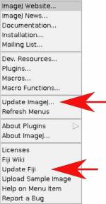{.align-center
width="150"} `
 <center>
  <b>Figure 1</b>. Options of updates in the main menu of Fiji/ImageJ.
 </center>
`{=html}

**NOTE:** WormBox will not work in ImageJ as distributed because this
plugin requires Jython. However, you can make ImageJ capable of dealing
with WormBox by installing Jython in your system ([see
here](http://marcora.caltech.edu/jython_imagej_howto.htm)). We have not
tried to do that and advise you to install Fiji/ImageJ, which seems to a
much easier solution.\

#### Installing the plugins

After downloading WormBox.zip and decompressing the ZIP file, you will
find two files within the folder: WormBox_Tools.txt and
WormBox_Analyzer.py. These files are the scripts of WormBox and will
have to be moved to specific locations within Fiji/ImageJ\'s folders.
Thus, move WormBox_Tools.txt to Fiji.app/macros/toolsets/ and
WormBox_Analyzer.py to Fiji.app/plugins/.

-   **NOTE:** MAC users could use the terminal to accomplish this task.
    -   Open the Terminal application;
    -   Move to the folder where WormBox.txt and WormBox\_.py are
        located (e.g., cd Desktop/WormBox);
    -   Execute \'cp WormBox.txt
        /Applications/Fiji.app/macros/toolsets/\';
    -   Execute \'cp WormBox\_.py /Applications/Fiji.app/plugins/\'.

#### Planning your project

\
WormBox uses landmarks to compute linear distances. Thus, before you
start, you should plan your project so that you have a clear idea of how
many landmarks you will need to obtain the measurements you want. You
can add more landmarks throughout the process, but we advise you to
really make an effort to plan ahead. We will illustrate the basics of
WormBox by using an example in which our goal is to obtain measurements
from a set of hooks for *Potamotrygonocestus* (a onchobothriid cestode).
With this example we hope to demonstrate how WormBox can be helpful.

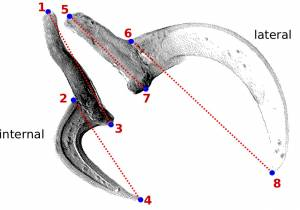{.align-center
width="300"} `
 <center>
  <b>Figure 2</b>. Definition of landmarks upon handles and prongs of internal and lateral bothridial hooks of <i>Potamotrygonocestus</i>.
 </center>
`{=html}\
You should start by defining the landmarks that would allow you to
calculate the distances (measurements) you need (Figure 2). In the
example below, we want to obtain the measurements from handles and
prongs of the internal and lateral bothridial hooks. Accordingly, we
defined 8 landmarks (Figure 2). WormBox allows you to set as many as
landmarks as you need (or wish), but you should always be careful and
minimize the amount of landmarks for practical reasons.\

#### Getting started with WormBox

Once you have a good idea of the measurements you want to take and the
landmarks required to do that, you should compile within a folder all
the images you want to extract the measurements. We provide a folder
called "hooks" that we will use in the first part of this tutorial. The
images in this folder have the hooks from which to obtain the
measurements defined in Figure 2. Ultimately, the images should be all
scaled, preferentially using ImageJ or Fiji/ImageJ. WormBox will inform
you whether it recognized the scales in your images. If WormBox does not
recognize the scale, it will ask you to set up the scale. Here are the
steps you should take to fully complete the first part of this tutorial
():

-   **Step 1**. Start Fiji/ImageJ and enable WormBox in the switch to
    alternate macro tool sets (Figure 3).

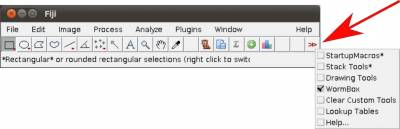{.align-center
width="400"} `
 <center>
  <b>Figure 3</b>. Selecting WormBox tool sets.
 </center>
`{=html}

Once the plugin is enabled, 5 new icons will become available to you
with the following function:

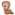{.align-left width="15"}
Initialize landmark setup and/or load ROI (Region of Interest) to
images.\
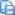{.align-left
width="15"}Save landmark positions.\
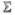{.align-left
width="15"} Count meristic variable.\
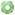{.align-left
width="15"} Add new landmarks.\
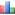{.align-left
width="15"} Run WomBox Analyzer, to compile measurements to \*.cvs
file.\

-   **Step 2**. Open the first image of your working folder. You can do
    that by either dragging the image into the Fiji/ImageJ main menu
    area (gray area) or by using File/Open.

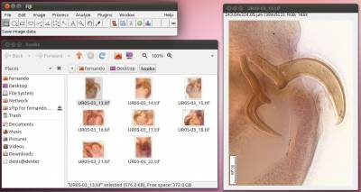{.align-center
width="400"}

`
 <center>
  <b>Figure 4</b>. Opening images in Fiji.
 </center>
`{=html}

**NOTE:** Files should be in \*.tif format and the extension should be
in lower case. WormBox will recognize all major images formats
recognized by Fiji/ImageJ. However, if the original image is not in
\*.tif format, or if the extension is written in upper case, WormBox
will make a copy of the image and save it as \*.tif after processing.

    ***Step 3**. Scaling images. If your images are not scaled by Fiji/ImageJ or, although scaled using a different software, Fiji/ImageJ did not recognize the scale, WormBox will require that a scale is provided and the warning window below will be presented.

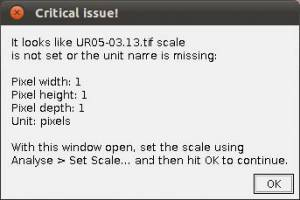{.align-center
width="300"} `
 <center>
  <b>Figure 5</b>. Request for providing a scale by WormBox.
 </center>
`{=html}

To scale the image in Fiji/ImageJ you will have to follow these steps:

-   **Step 3a** Select the \"straight\" tool to draw lines. =

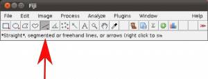{.align-center
width="300"} `
 <center>
  <b>Figure 6</b>. Selecting the straight line tool in ImageJ.
 </center>
`{=html}

-   **Step 3b** Draw a straight line using as reference the scale bar
    embedded into the image.

```{=html}
<!-- -->
```
-   **Step 3c** In the main menu, select Analyze/Set Scale and provide
    the known distance (i.e., 50)

and the unity of the length (*i.e.*, *um*).

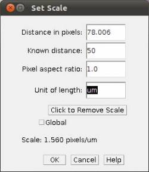{.align-center
width="250"} `
 <center>
  <b>Figure 7</b>. Set scale menu in ImageJ.
 </center>
`{=html}

**NOTE:** It might be easier to have all images scaled before setting up
landmarks. But that is not mandatory, you can provide the scales as you
work in each image.

-   **Step 4** Placing landmarks. If you have opened a image and WormBox
    has recognized the scale, you are ready to define and/or place the
    landmarks you desire to obtain the measurements you want. Press the
    button to load ROI from the WormBox tool set. If this is the first
    time you are using WormBox for the images within a given folder you
    will have to define the number of landmarks you will be working.

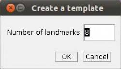{.align-center
width="250"} `
 <center>
  <b>Figure 8</b>. Defining the number of landmarks in WormBox.
 </center>
`{=html}

As we mentioned above (Figure 2), we will need 8 landmarks for the
measurements we are planning to take from the hooks. By selecting 8 and
pressing "OK", we will define a template with eight landmarks which will
be used for all images in this folder (Figure 9A). A file called
RoiSet.zip will be created and all landmarks will appear on the left
part of the image.

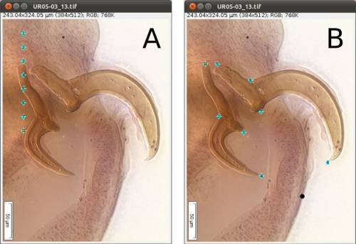{.align-center
width="500"} `
 <center>
  <b>Figure 9</b>. <b>A</b>, landmark pasted on image after defining numbers of landmarks or loading template. <b>B</b>, landmarks placed in desired positions.
 </center>
`{=html}

Once the landmarks have been defined or loaded, all you have to do is to
drag the landmarks to its right position using the mouse (double-click
on the landmark you want to move and drag; if you prefer, you also can
select the landmark\`s number on the box (ROI) and after that click once
on the landmark in the figure and drag it) (Figures 2 and 9B) and then
save it using the icon in the macro tool set menu of WormBox. After
saving the image, WormBox will wipe the landmarks from the image.
However, all information will be still there, saved in associated files
with extensions \*.txt and \*.zip. These files will be used to compile
the information after you process all images and **SHOULD NOT BE
REMOVED** -- unless you want to wipe out all the data. If you desire to
verify and or modify the positions of the landmarks, just reload the ROI
using the icon in the macro tool set menu of WormBox.

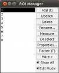{.align-right
width="100"}\
\
**NOTE:** WormBox allows you to delete any landmark if you feel that a
given measurement should not be taken from a given image. All you have
to do is to place the landmarks that you consider that should be
included in the image and use the ROI manager to delete the ones that
should not be taken into account. In its final stage, when WormBox will
parse the images to compile the measurements, images for which one or
more landmarks are missing, will still be used. WormBox will attribute
"NA" for cells in which the distance could not be calculated by the lack
of landmarks in the \*.cvs file (see below).\
\
**NOTE:** WormBox allows you to add landmarks if you want to. All you
have to do is to click on the icon in the macro tool set menu of
WormBox, write the number of landmarks you want and press ok. The new
landmarks will appear on the image. You only can add landmarks in the
end of your landmarks that already exists, for example, if you have
landmarks 1,2 and 3 and you add more 2 landmarks, this landmarks will be
the number 4 and 5. If you count some structures, this will be
interpreted by WormBox like a landmark, for example, in this case we
have 5 landmarks and 2 counted structures. This two structures counted
will be landmarks 6 and 7, so, if you add 2 new landmarks, this will be
the number 8 and 9, and not the 6 and 7. The ideal situation is add all
landmarks you want before count structures.\
\
**\*Step 5** Compiling the data from images. Once you have processed all
images (in this particular example it should take less than 10 minutes
to process all 8 images) you will have to write a configuration file to
run the compiling tool of WormBox. The configuration file should be in a
plain text format. Thus, do not use Word or any other text editor the
leave hidden characters into the text. Linux users could use nano, vim,
or Geditand, among others. Mac users could use TextEdit, Wrangler, or
nano, among others. Here is an example of the file:

    internal_handle:1,3
    internal_prong:2,4
    lateral_handle:5,7
    lateral_prong:6,8

Each line should contain the name of the variable, followed by ":" and
at least two landmarks separated by comma defining the two points from
which WormBox will calculate the distance.

**NOTE:** You can use more than two land marks for a single variable.
For instance, your configuration file could have a line like this:
"variable_x:1,2,3,4". In this case, the measurement for "variable_x"
will be the sum of the distances between 1\--2, 2\--3, and 3\--4.

Once you have written your configuration file (*e.g.*,
hooks_measurements.conf) and saved it, run the WormBox Analyzer (see
definition of icons above). First, WormBox will ask you the target
folder in which your images have been processed (Figure 10A); and then
the name of your configuration file (Figure 10B).

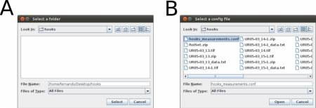{.align-center
width="450"} `
 <center>
  <b>Figure 10</b>. <b>A</b>, menu for selecting target folder. <b>B</b>, menu to specify configuration file.
 </center>
`{=html}

Finally, you will have to specify the output file name. WormBox will
generate a \*.csv (comma separated values) text file that can be opened
in any spreadsheet software (*e.g.*, Excel, OpenOffice, among others) as
demonstrated in Figure 11.

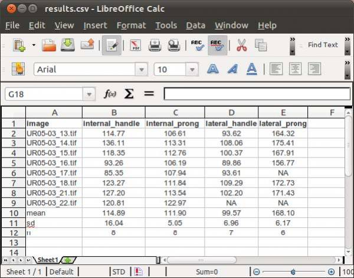{.align-center
width="600"} `
 <center>
  <b>Figure 11</b>. Summary results from WormBox showed by opening the *.csv file in OpenOffice Spreadsheet.
 </center>
`{=html}

The summary results will contain a column with the image names and each
variable will be displayed in a separated column. The three last lines
of the file will compile the average, standard deviation and sample size
of each variable. Cells with "NA" (as Non Available) denote measurements
that were not taken due to the lack of associated landmark(s).

#### More on WormBox (advanced features)

Now we will explore some other features of WormBox. We provide a folder
called "proglottids" upon which we base this second part of the
tutorial. Within this folder you should find 3 images of loose
proglottids of *Potamotrygonocestus*, all of which have been scaled
using Fiji/Image.

In Figure 12 we depict the landmarks we wish to use to compile length
and width of the proglottids, position of the genital pore, and testes
diameters. We also will compute the number of testes for each
proglottid. Thus, we will make use of the counting tool in WormBox,
which we have neglected in the first part of the tutorial. Except for
the fact that we are using two sets of landmarks to compute testes
diameter, and that the total length of the proglottids will be
calculated the sum of two distances (i.e., 1\--2 and 2\--3), you should
have no problem with that if you went through the first part of the
tutorial. It is true that the configuration file will have to specify
that; which will be addressed latter. Thus, let\'s see how we count
structures using WormBox.

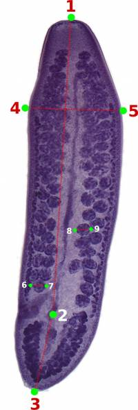{.align-center
width="200"} `
 <center>
  <b>Figure 12</b>. Landmarks on loose proglottids of<i>Potamotrygonocestus</i>.
 </center>
`{=html}

##### Counting structures:

Before starting the use of the counting toll of WormBox, you should:

1.  Define the number of landmarks you need.
2.  Place them in the right positions.
3.  Save image (required).

The steps above have been described in the first part of the tutorial.
If you have any difficulties, please go back and have a quick look
above. To start counting, you have to enable the function to count
meristic variables (icon with Σ sign). By doing that, you will turn on
the multi-point tool of Fiji/ImageJ and a window named "action required"
will appear.

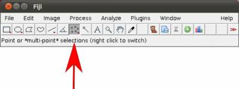{.align-center
width="400"} `
 <center>
  <b>Figure 13</b>. Enabling the multi-point tool of Fiji/ImageJ.
 </center>
`{=html}

Once the counting tool is on, all you have to do is to position your
mouse on top of the structures you want to count and click the mouse.
Here, we will count two sets of testes: poral and aporal ones. As you
start clicking on top of the testes, let\'s say on the aporal side,
landmarks in yellow will provide the counting (Figure 14).

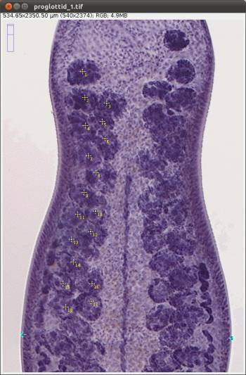{.align-center
width="350"} `
 <center>
  <b>Figure 14</b>. Image showing landmarks in blue and counting unities in yellow for partial counts of aporal testes.
 </center>
`{=html}

After concluding counting the aporal testes, you should click on "OK" on
the window for "Action Required" and this will prompt WormBox to ask you
to name of the variable you just counted (*e.g.*, aporal_testes).

**NOTE:** Watch out for spelling error here otherwise the script will
consider them as different variables. It is important to inform you that
the script is case sensitive. Thus, "testes" and "Testes" will be
understood as two different variables.

Now, let us count the other set of testes, *i.e.*, poral testes. You can
start by loading all you have done thus far by pressing the icon to load
ROI into image. If you load the ROI, you should have something like
Figure 15.

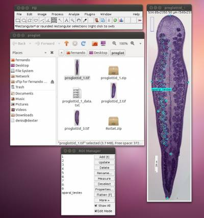{.align-center
width="400"} `
 <center>
  <b>Figure 15</b>. Summary information after loading ROI at this point.
 </center>
`{=html}

The image should display all landmarks for calculating distances and
counting, and the ROI manager should have a list of all landmarks and
variables. Now proceed to count the poral testes by enabling the
counting tool and repeating the steps you did before in which you count
the aporal testes. You should repeat all the steps above for the other
remaining (2) images.

##### Compiling results (complex version)

As explained above, you will need to specify a configuration file to
parse all the information you implemented in each image. Here we will
apply a configuration file a bit more sophisticated than before. Within
the configuration file, we will not only obtain euclidean distances
between landmarks but also specify new variables based on operations of
those distances.

Below we provide a example of configuration file to illustrate this
capability of WormBox. For explanation proposes, each line is specified
by a number (*e.g.*, #1), which should not be in the configuration file:

    #1  length:1,2,3
    #2  width:4,5
    #3  progl_ratio:${length}//${width}
    #4  genital_pore_distance:2,3
    #5  genital_pore_position:${genital_pore_distance}*100/${length}
    #6  testes_dia:6,7
    #7  testes_dia:8,9
    #8  aporal_testes:count
    #9  poral_testes:count
    #10 total_testes:${aporal_testes}+${poral_testes}

Here is what this configuration file will do with the data you compiled
for each image:

-   Lines 1 and 2 (i.e., #1 and #2) will calculate the length and width
    of your proglottid, which except for the fact that the length is
    being calculated by the sum of two distances (i.e., 1\--2 + 2\--3),
    they are the kind of distances you calculated before in the first
    part of this tutorial.

```{=html}
<!-- -->
```
-   Line 3 provides something new. Here we defined a new morphometric
    variable,"progl_ratio", which is equal to the floored quotient of
    length and width of the proglottid; that is, its ratio. To operate
    with variables there are few rules you must follow:\
    \* You can only operate with variables that were defined before.
    That is, line 3 could not be written prior to lines #1 and #2.\
    \* The syntax for operating variables should be
    "\${name_of_variable}".\
    \* The operator used in WormBox are basically those available in
    Python:\

  Operation   Result
  ----------- -----------------------------
  x + y       sum of x and y
  x - y       difference of x and y
  x \* y      product of x and y
  x / y       quotient of x and y
  x // y      floored quotient of x and y
  pow(x, y)   x to the power y
  x \*\* y    x to the power y

-   Other lines that make use of this property are lines 5 and 10 in
    which we calculate the genital pore position and the total number of
    testes, respectively.\
    \* Next, we should comment lines 8 and 9. These two redundant lines
    specify the distances for testes diameter (*i.e.*, 6\--7 and 8\--9).
    For those, when WormBox parse the information of an image, it
    compiles the mean value between 2 or more pseudo-replicates (or
    repetitive measures).\

Finally, meristic variable are defined by its name followed by ":count".
Examples of that are the testes counts defined in "aporal_testes" and
"poral_testes", lines 8 and 9, respectively.

The final results should be something like this:

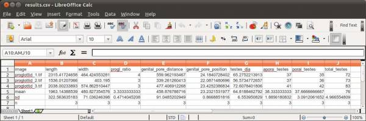{.align-center
width="600"} `
 <center>
  <b>Figure 16</b>. Summary results from WormBox showed by opening the *.csv file in OpenOffice Spreadsheet.
 </center>
`{=html}\

